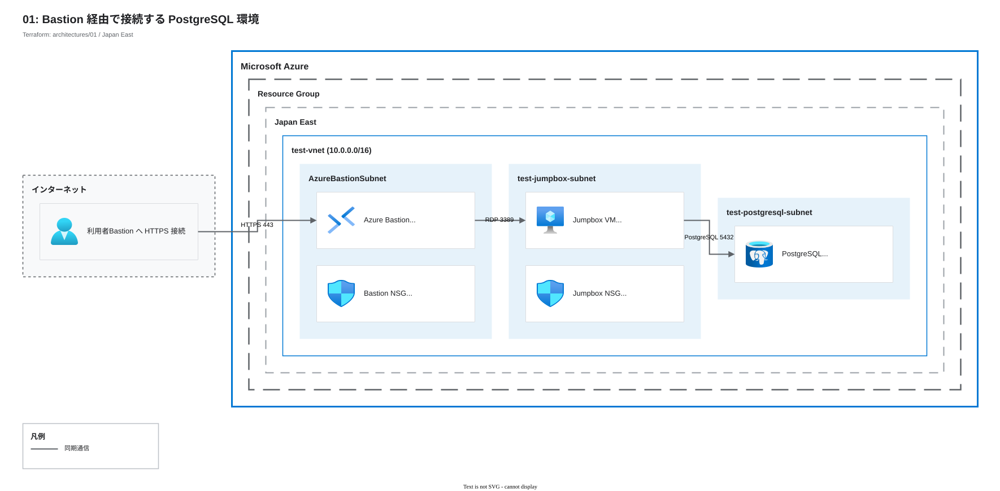

# Azure Bastion と Jumpbox を使う閉域 PostgreSQL 管理

`architectures/01` は、Azure Bastion から Windows Jumpbox へ RDP 接続し、Jumpbox から VNet 統合した Azure Database for PostgreSQL Flexible Server を操作する Terraform 構成である。このドキュメントは Terraform、構成図、Azure の公式資料を根拠にまとめた。実環境の運用記録ではなく、コードから確認できる範囲を扱う。

## 想定シナリオ

DB の保守担当者は、インターネットから到達できる VM を増やさずに PostgreSQL へ接続したい。担当者は Azure Portal で Azure Bastion のセッションを開き、プライベート IP の Windows Jumpbox に RDP 接続する。DB クライアントは Jumpbox 上で動かす。

Azure Bastion はリバースプロキシではない。VM に Public IP を付けず、Portal から RDP/SSH セッションを提供するマネージドの管理アクセスサービスである。この構成は Bastion の Public IP と Jumpbox の管理ポートを別物として扱う。Public IP は Bastion にだけ関連付け、Jumpbox の NIC は動的なプライベート IP だけを取得する。

PostgreSQL Flexible Server は VNet の委任サブネットに置き、`public_network_access_enabled = false` を設定する。Private access で作成した Flexible Server は公開エンドポイントを持たず、VNet からの接続に Private DNS Zone が必要になる。[Microsoft Learn: VNet 統合](https://learn.microsoft.com/ja-jp/azure/postgresql/flexible-server/concepts-networking-private)

## 構成図

## 設計判断

### ADR-001: Bastion に管理セッションを集める

- 背景: Jumpbox の RDP を公開すると、管理用 VM の受信面がインターネットに出る。
- 決定: `AzureBastionSubnet` に Standard SKU の Azure Bastion を配置した。Jumpbox の NSG は Bastion サブネットからの RDP と SSH を許可し、最後のルールで他の受信を拒否する。
- 比較: Jumpbox に Public IP を付けて送信元 IP を制限する方法は、このケーススタディでは採らない。管理者の接続先を Bastion に集めるほうが、この学習テーマの意図に合う。
- 影響: Bastion はデプロイ中ずっと課金される。Bastion サブネットへ NSG を関連付ける場合、443、22/3389、8080/5701、80 の必須ルールが不足すると接続やサービス更新が失敗する。[Azure Bastion の NSG 要件](https://learn.microsoft.com/ja-jp/azure/bastion/bastion-nsg)

### ADR-002: Flexible Server を VNet へ統合する

- 背景: DB に接続できるクライアントを VNet 内へ限る。
- 決定: PostgreSQL 用サブネットを `Microsoft.DBforPostgreSQL/flexibleServers` へ委任し、Flexible Server に `delegated_subnet_id` と `private_dns_zone_id` を渡す。Jumpbox の NSG は DB サブネット宛ての TCP 5432 を許可し、DB のパブリックアクセスは無効にする。
- 比較: Public access とサーバーレベルの IP ファイアウォール規則を使う構成は、このケーススタディでは見送る。公開エンドポイントと許可 IP の管理が残るからである。
- 影響: Private DNS Zone を VNet にリンクしないと、Jumpbox は Flexible Server の FQDN を解決できない。Terraform は DNS Zone と VNet リンクをネットワークモジュールで作成する。[Microsoft Learn: Private DNS Zone](https://learn.microsoft.com/ja-jp/azure/postgresql/flexible-server/concepts-networking-private#use-a-private-dns-zone)

## コスト試算

常設時の概算は月額 USD 473.08 である。2026-08-16 に Japan East、従量課金、730 時間/月を前提として、[Azure Pricing Calculator](https://azure.microsoft.com/ja-jp/pricing/calculator/) と [Azure Retail Prices API](https://prices.azure.com/api/retail/prices) の公開価格を確認し、`main/local.tf` の SKU に合わせて計算した。契約形態、為替、利用量で請求額は変わる。

| 構成 | 計算 | 月額概算 |
| --- | --- | ---: |
| Azure Bastion Standard | USD 0.29/時間 × 730 時間 | USD 211.70 |
| Windows Jumpbox `Standard_B2ms` | USD 0.117/時間 × 730 時間 | USD 85.41 |
| PostgreSQL General Purpose `D2s_v3`、2 vCore | USD 0.1175/vCore 時間 × 2 × 730 時間 | USD 171.55 |
| PostgreSQL ストレージ 32 GiB | USD 0.138/GiB 月 × 32 GiB | USD 4.42 |
| 合計 | 常時稼働する主要リソース | **USD 473.08** |

PostgreSQL ではコンピューティング、ストレージ、バックアップが別々に課金される。[Azure Database for PostgreSQL の料金](https://azure.microsoft.com/ja-jp/pricing/details/postgresql/flexible-server/) この試算に含めたのは主要な固定費だけである。バックアップの超過分、Bastion のデータ転送、Public IP、Jumpbox のマネージド ディスク、Private DNS Zone のクエリ、ネットワーク転送、税は含めていない。Bastion Standard の月額が大きいため、学習が終わった環境を残しておく理由は薄い。

## セキュリティと運用

### 実装済みのこと

- Bastion には Standard Public IP を関連付けるが、Jumpbox の NIC には Public IP を定義しない。
- Bastion 用 NSG は Portal からの HTTPS、Azure の制御プレーンとヘルスプローブ、Bastion 間通信、VNet 内の VM への RDP/SSH を許可する。Jumpbox 用 NSG は Bastion サブネットからの RDP/SSH と DB 宛ての TCP 5432 を明示し、その他を拒否する。
- PostgreSQL Flexible Server は委任サブネット、Private DNS Zone、`public_network_access_enabled = false` を使う。バックアップ保持期間は 7 日で、ストレージの自動拡張も有効にする。
- Jumpbox と DB の管理者パスワードは `random_password` で生成する。Terraform の root output は空であり、パスワードを output には出さない。

### 確認と削除

1. `main/` で `terraform apply` を実行する。
2. Azure Portal から Bastion を開き、Jumpbox のプライベート IP へ RDP 接続する。
3. Jumpbox に DB クライアントを手動で用意し、Flexible Server の FQDN が Private DNS Zone を通じて解決できることを確認してから PostgreSQL へ接続する。クライアントを入れる VM 拡張は、この構成では無効化している。
4. 学習が済んだら `main/` で `terraform destroy` を実行し、Bastion、VM、DB を削除する。

### テーマの範囲

この構成は管理接続、Jumpbox の受信制限、VNet 統合した PostgreSQL の到達性を扱う。テナントの権限設計、監視、可用性、災害復旧は Terraform に定義していないため、このドキュメントの対象にしない。

## コード

- [ルートモジュール](./main)
- [ネットワークモジュール](./modules/network)
- [Bastion モジュール](./modules/bastion)
- [Jumpbox モジュール](./modules/jumpbox)
- [データベースモジュール](./modules/database)
- [terraform-docs 出力](./README_TERRAFORM_DOCS.md)

公開リポジトリ URL は、公開時の所有者とリポジトリ名が確定してから追加する。

## 学びと改善余地

この構成で大事なのは、Bastion の Public IP と Jumpbox の公開では意味が違う点である。Bastion が VNet 内の Jumpbox へ RDP/SSH をつなぎ、Jumpbox の NSG が Bastion サブネットからの通信だけを通す。Portal を開けることと、VM の 3389 を公開することを混同しないための題材になる。

DB を VNet 統合にすると、ネットワークだけでは接続できない。Jumpbox が DB の FQDN を解決できるように、Private DNS Zone と VNet リンクまで Terraform で管理する必要がある。接続テストでは、5432 の到達性と FQDN の名前解決を分けて確かめる。
